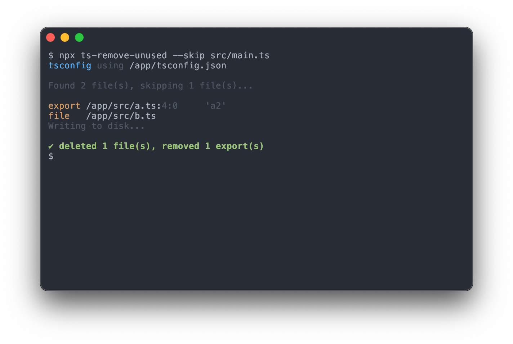

<h1 align="center">ts-remove-unused</h1>
<div align="center">
  
  <p>Remove unused code from your TypeScript Project</p>
</div>

[](https://badge.fury.io/js/@line%2Fts-remove-unused)
[](https://github.com/line/ts-remove-unused/actions/workflows/ci.yml)

## Features

- 🛠️ Auto-fix unused exports — removes the `export` keyword from the declaration or the whole declaration based on its usage
- 🧹 Deletes TypeScript modules that have no referenced exports
- 🕵️ `--check` mode — reports unused exports and deletable files without writing changes

## Install

```bash
npm install @line/ts-remove-unused
```

TypeScript is a peer dependency.

## Quick Start

1. 🔍 Check your `tsconfig.json` – Make sure `include` and `exclude` is configured thoroughly so that we can correctly detect what's "unused" in your project.

2. 🔍 Check your entrypoint files – What's the file that is the starting point for your code? Without this information, all files will be recognized as unnecessary. Usually it is some file like `src/main.ts` or maybe a group of files like `src/pages/*`.

3. 🚀 Execute – Set a regex pattern that matches your entry files for `--skip`. You can optionally set `--project` to a path to your custom `tsconfig.json` if necessary.

```bash
npx @line/ts-remove-unused --skip 'src/main\.ts$'
```

> [!WARNING]
> THIS COMMAND WILL DELETE CODE FROM YOUR PROJECT. Using it in a git controlled environment is highly recommended. If you're just playing around use `--check`.

## Examples

Here are some examples of how this tool will auto-fixe unused code.

<!-- prettier-ignore-start -->

When `a2` is not used within the project:

```diff
--- src/a.ts
+++ src/a.ts
@@ -1,3 +1 @@
 export const a = 'a';
-
-export const a2 = 'a2';
```

When `b` is not used within the project but `f()` is used within the project:

```diff
--- src/b.ts
+++ src/b.ts
@@ -1,5 +1,5 @@
-export const b = 'b';
+const b = 'b';
 
 export function f() {
     return b;
 }
```

When `f()` is not used within the project and when deleting it will result in `import` being unnecessary:

```diff
--- src/c.ts
+++ src/c.ts
@@ -1,7 +1 @@
-import { cwd } from "node:process";
-
 export const c = 'c';
-
-export function f() {
-    return cwd();
-}
```

When `f()` and `exported` are not used within the project and when deleting `f()` will result in `exported` and `local` being unnecessary:

```diff
--- src/d.ts
+++ src/d.ts
@@ -1,8 +1 @@
-export const exported = "exported";
-const local = "local";
-
 export const d = "d";
-
-export function f() {
-  return { exported, local };
-}

```

<!-- prettier-ignore-end -->

In addition to the behavior shown in the examples above, ts-remove-unused will delete files that have no used exports.

ts-remove-unused works with all kinds of code: variables, functions, interfaces, classes, type aliases and more!

## Usage

### Options

<!-- prettier-ignore-start -->

```
Usage:
  $ ts-remove-unused 

Commands:
    There are no subcommands. Simply execute ts-remove-unused

For more info, run any command with the `--help` flag:
  $ ts-remove-unused --help

Options:
  --project <file>          Path to your tsconfig.json 
  --skip <regexp_pattern>   Specify the regexp pattern to match files that should be skipped from transforming 
  --include-d-ts            Include .d.ts files in target for transformation 
  --check                   Check if there are any unused exports without removing them 
  --experimental-recursive  Recursively process files until there are no issue 
  -h, --help                Display this message 
  -v, --version             Display version number 

```
<!-- prettier-ignore-end -->

#### `--project`

Specifies the `tsconfig.json` that is used to analyze your codebase. Defaults to `tsconfig.json` in your project root.

```bash
npx @line/ts-remove-unused --skip tsconfig.client.json
```

#### `--skip`

Skip files that match a given regex pattern. Note that you can pass multiple patterns.

```bash
npx @line/ts-remove-unused --skip 'src/main\.ts' --skip '/pages/'
```

#### `--include-d-ts`

By default, `.d.ts` files are skipped. If you want to include `.d.ts` files, use the `--include-d-ts` option.

#### `--check`

Use `--check` to check for unused files and exports without making changes to project files. The command will exit with exit code 1 if there are any unused files or exports discovered.

```bash
npx @line/ts-remove-unused --skip 'src/main\.ts' --check
```

#### `--experimental-recursive`

The default behavior of the CLI is to process all files once. Some issues may not be detected if the unused code is a result of the modification of another file in the project. When this option is enabled, ts-remove-unused will recursively re-edit/re-check files that may be affected by a file edit.

This option is still experimental since it's not optimized (yet) for large scale projects. Using this flag for large scale projects is not recommended.

### Use the JavaScript API

Alternatively, you can use the JavaScript API to execute ts-remove-unused.

```typescript
import { remove } from '@line/ts-remove-unused';

await remove({
  configPath: '/path/to/project/tsconfig.json',
  projectRoot: '/path/to/project',
  skip: [/main\.ts/],
  mode: 'write',
});
```

### Skip

When you add a comment `// ts-remove-unused-skip` to your export declaration, it will be skipped from being removed

```ts
// ts-remove-unused-skip
export const hello = 'world';
```

## Handling test files

If you have a separate tsconfig for tests using [Project References](https://www.typescriptlang.org/docs/handbook/project-references.html), that would be great! ts-remove-unused will remove exports/files that exist for the sake of testing.

If you pass a `tsconfig.json` to the CLI that includes both the implementation and the test files, ts-remove-unused will remove your test files since they are not referenced by your entry point file (which is specified in `--skip`). You can avoid tests being deleted by passing a pattern that matches your test files to `--skip` in the meantime, but the recommended way is to use project references to ensure your TypeScript config is more robust and strict (not just for using this tool).

## Comparison

### TypeScript

If you enable `compilerOptions.noUnusedLocals`, declarations that are never read will be reported.

```typescript
// 'a' is declared but its value is never read.
const a = 'a';
```

However, when you `export` it, no errors will be reported regardless of its usage within the project. ts-remove-unused's aim is to report/fix unused code while taking project wide usage into account.

### ESLint

ESLint will detect unused imports. Plugins such as `eslint-plugin-unused-imports` can also auto-fix this issue.

```typescript
// 'foo' is defined but never used.
import { foo } from './foo';
```

However, we can't detect unused exports. ESLint's architecture works in a file by file basis and was never intended to provide linting based on project-wide usage stats.

```typescript
// a lint rule that detects if this export is used within the project is unlikely to be introduced
export const a = 'a';
```

ts-remove-unused's main goal is to remove unused exports and delete unused modules, but it will also delete unused imports that are a result of removing an export declaration.

## Author

Kazushi Konosu (https://github.com/kazushisan)

## Contributing

Contributions are welcomed!

## License

```
Copyright (C) 2023 LINE Corp.

Licensed under the Apache License, Version 2.0 (the "License");
you may not use this file except in compliance with the License.
You may obtain a copy of the License at

   http://www.apache.org/licenses/LICENSE-2.0

Unless required by applicable law or agreed to in writing, software
distributed under the License is distributed on an "AS IS" BASIS,
WITHOUT WARRANTIES OR CONDITIONS OF ANY KIND, either express or implied.
See the License for the specific language governing permissions and
limitations under the License.
```
