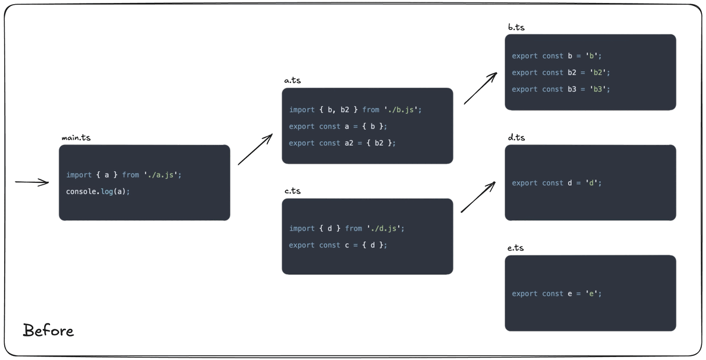

# tsr

[](https://badge.fury.io/js/tsr)
[](https://packagephobia.com/result?p=tsr)
[](https://github.com/line/tsr/actions/workflows/ci.yml)

TypeScript Remove (tsr) is a utility that removes unused code from TypeScript projects – It's like tree shaking, but for source files

## Features

<div align="center">
  
</div>

### 🕵️ Find unused code

tsr statically analyses your TypeScript project like how tree-shaking is implemented in bundlers. Run tsr to get a list of unused exports and files (modules) in your TypeScript project. Use tsr in your CI pipeline to detect unused code from being added.

### 🧹 Remove unused code automatically

tsr is built for automatic code removal. Not only does tsr remove the `export` keyword from unused declarations, it will remove the whole declaration if the declaration not used within the file. tsr will also remove imports and other local declarations that became unnecessary after removing the declaration. [Check out the examples of how tsr edits your files.](#examples)

### 📦 Works out of the box

tsr uses the TypeScript compiler to detect files in your project and resolve imports. The only requirement is a valid `tsconfig.json`. There's no need to setup another config file to get tsr running. Specify your entrypoint file and start using tsr in seconds.

## Install

```bash
npm i tsr
```

TypeScript is a peer dependency.

## Quick Start

1. **🔍 Check your `tsconfig.json`** – Make sure `include` and `exclude` are configured thoroughly so that tsr can correctly detect unused code.

2. **🔍 Check your entrypoint files** – Without entrypoint files, all files are unnecessary. Usually it is some file like `src/main.ts` or maybe a group of files like `src/pages/*`.

3. **🚀 Execute** – Pass regex patterns that match the entrypoints. Use `--write` to change the files in place.

```bash
npx tsr 'src/main\.ts$'
```

## Usage

### CLI

<!-- prettier-ignore-start -->

```
Usage:
  $ tsr [...entrypoints]

Commands:
  [...entrypoints]  regex patterns to match entrypoints

For more info, run any command with the `--help` flag:
  $ tsr --help

Options:
  -p, --project <file>  Path to your tsconfig.json 
  -w, --write           Write changes in place 
  -r, --recursive       Recursively look into files until the project is clean 
  --include-d-ts        Check for unused code in .d.ts files 
  -h, --help            Display this message 
  -v, --version         Display version number 

Examples:
npx tsr 'src/main\.ts$'
```
<!-- prettier-ignore-end -->

#### `-p`, `--project`

Specifies the `tsconfig.json` that is used to analyze your codebase. Defaults to `tsconfig.json` in your project root.

```bash
npx tsr --project tsconfig.client.json 'src/main\.ts$'
```

#### `-w`, `--write`

Writes fixable changes in place.

> [!WARNING]
> This will delete code. Using it in a git controlled environment is highly recommended.

#### `-r`, `--recursive`

The default behavior of the CLI is to process all files once. Some issues may not be detected if the unused code is a result of the modification of another file in the project. When this option is enabled, tsr will recursively look into files that may be affected by a file edit.

This will take longer but is helpful when you want to edit in one pass.

#### `--include-d-ts`

By default, exported types in `.d.ts` files are not detected. Use the `--include-d-ts` option if you want to include types in `.d.ts` files

### JavaScript API

Alternatively, you can use the JavaScript API to execute tsr.

```typescript
import { tsr } from 'tsr';

await tsr({
  entrypoints: [/main\.ts/],
  mode: 'check',
});
```

The project path and/or the custom `tsconfig.json` can be manually specified.

```typescript
await tsr({
  entrypoints: [/main\.ts/],
  mode: 'check',
  configFile: 'tsconfig.sample.json',
  projectRoot: '/path/to/project',
});
```

Check the type definition `import('tsr').Config` for all of the available options.

## Skip

When you add a comment `// tsr-skip` to your export declaration, it will be skipped from being removed

```ts
// tsr-skip
export const hello = 'world';
```

## Test files

If you have a separate tsconfig for tests using [Project References](https://www.typescriptlang.org/docs/handbook/project-references.html), that would be great! tsr will remove exports/files that exist for the sake of testing.

If you pass a `tsconfig.json` to the CLI that includes both the implementation and the test files, tsr will remove your test files since they are not referenced by your entry point file by default. You can avoid tests being deleted by passing a pattern that matches your test files to the args in the meantime, but the recommended way is to use project references to ensure your TypeScript config is more robust and strict (not just for using this tool).

```bash
npx tsr -w 'src/main\.ts$' ## depending on the tsconfig, this will delete test files
npx tsr -w 'src/main\.ts$' '.*\.test\.ts$' ## Specifying test files as entrypoints will avoid deletion
```

## Comparison

### TypeScript

If you enable `compilerOptions.noUnusedLocals`, declarations that are never read will be reported.

```typescript
// 'a' is declared but its value is never read.
const a = 'a';
```

However, when you `export` it, no errors will be reported regardless of its usage within the project. tsr's aim is to report/fix unused code while taking project wide usage into account.

### ESLint

ESLint will detect unused imports. Plugins such as `eslint-plugin-unused-imports` can also auto-fix this issue.

```typescript
// 'foo' is defined but never used.
import { foo } from './foo';
```

However, we can't detect unused exports. ESLint's architecture works in a file by file basis and was never intended to provide linting based on project-wide usage stats.

```typescript
// a lint rule that detects if this export is used within the project is unlikely to be introduced
export const a = 'a';
```

tsr's main goal is to remove unused exports and delete unused modules, but it will also delete unused imports that are a result of removing an export declaration.

## Examples

Here are some examples of how tsr edits your files when it finds unused code.

<!-- prettier-ignore-start -->

When `a2` is not used within the project:

```diff
--- src/a.ts
+++ src/a.ts
@@ -1,3 +1 @@
 export const a = 'a';
-
-export const a2 = 'a2';
```

When `b` is not used within the project but `f()` is used within the project:

```diff
--- src/b.ts
+++ src/b.ts
@@ -1,5 +1,5 @@
-export const b = 'b';
+const b = 'b';
 
 export function f() {
     return b;
 }
```

When `f()` is not used within the project and when deleting it will result in `import` being unnecessary:

```diff
--- src/c.ts
+++ src/c.ts
@@ -1,7 +1 @@
-import { cwd } from "node:process";
-
 export const c = 'c';
-
-export function f() {
-    return cwd();
-}
```

When `f()` and `exported` are not used within the project and when deleting `f()` will result in `exported` and `local` being unnecessary:

```diff
--- src/d.ts
+++ src/d.ts
@@ -1,8 +1 @@
-export const exported = "exported";
-const local = "local";
-
 export const d = "d";
-
-export function f() {
-  return { exported, local };
-}

```

<!-- prettier-ignore-end -->

## Contributing

Contributions are welcomed!

## Author

Kazushi Konosu (https://github.com/kazushisan)

## License

```
Copyright (C) 2023 LINE Corp.

Licensed under the Apache License, Version 2.0 (the "License");
you may not use this file except in compliance with the License.
You may obtain a copy of the License at

   http://www.apache.org/licenses/LICENSE-2.0

Unless required by applicable law or agreed to in writing, software
distributed under the License is distributed on an "AS IS" BASIS,
WITHOUT WARRANTIES OR CONDITIONS OF ANY KIND, either express or implied.
See the License for the specific language governing permissions and
limitations under the License.
```
